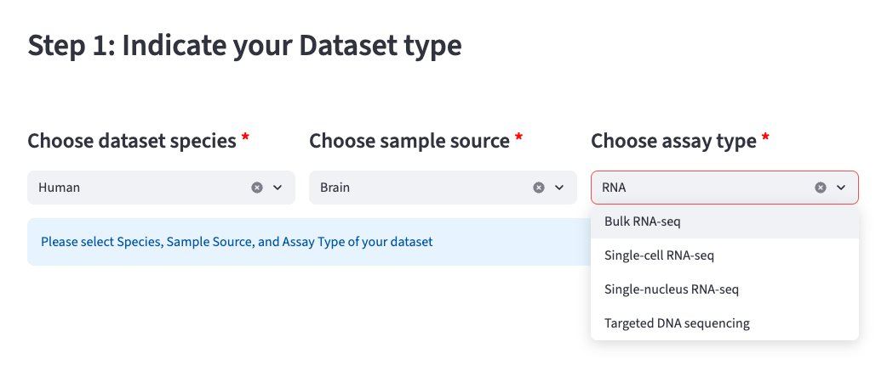

# Step 1: Indicate your Dataset type

The first thing the app needs to know is what kind of dataset you are submitting. This determines which CSV files are expected and which columns must be present in each file.

{ width="700" }

## What to select

Use the three dropdown menus to describe your dataset:

- **Species** — e.g. Human, Mouse
- **Sample source** — e.g. Brain
- **Assay type** — e.g. Single-cell RNA-seq, Bulk RNA-seq, Targeted DNA sequencing

!!! tip
    All three fields are required (marked with a red asterisk ✱). The app will not proceed until all three are selected.

## What happens next

Once all three are selected, a sidebar will appear on the left with a download button for your template CSV files — proceed to [Step 2](step2-template-download.md).
