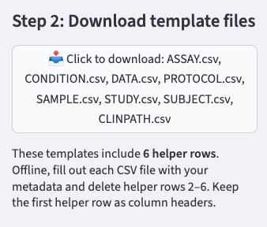

# Step 2: Download template files

After selecting your dataset type in Step 1, the app generates a set of CSV template files tailored to your selection.

{ width="400" }

## What to download

Click the download button in the sidebar to get a zip file containing one CSV per expected table (e.g. `ASSAY.csv`, `SAMPLE.csv`, `STUDY.csv`, etc.). The exact files depend on your Step 1 selections.

## What's inside each template

Each CSV includes **6 helper rows** at the top:

| Row | Content |
|-----|---------|
| 1 | Column headers |
| 2 | Column descriptions |
| 3 | Data types (`Integer`, `Float`, `String`, or `Enum`) |
| 4 | Required status (`Required` or `Optional`) |
| 5 | Validation rules (valid values for `Enum` columns) |
| 6 | Example values |

## How to fill out the templates

1. Open each CSV in your preferred tool (Excel, Google Sheets, R, Python, etc.)
2. Fill in **row 7 onwards** with your actual metadata
3. When done, **delete rows 2–6** — keep only the column headers (row 1) and your data

!!! warning
    Do not rename or reorder column headers. The app matches columns by name.

!!! tip
    Filling out templates programmatically (e.g. with a script) reduces the risk of typos and avoids issues with Excel reformatting date-like strings.

Once your files are filled out, proceed to [Step 3](step3-upload-files.md).
