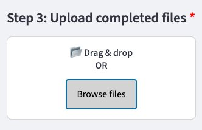

# Step 3: Upload your completed files

Once your CSV files are filled out and helper rows 2–6 are removed, upload them to the app.

{ width="400" }

## How to upload

Drag and drop your CSV files onto the upload box, or click **Browse files** to select them from your computer. You can upload multiple files at once.

Each uploaded file becomes a **TABLE** in the app that can be checked and validated independently.

!!! note
    You can upload files from multiple CSV templates in one go — the app will handle each one separately.

Once uploaded, the app will automatically move to [Step 4](step4-fix-issues.md) to check for common issues.
