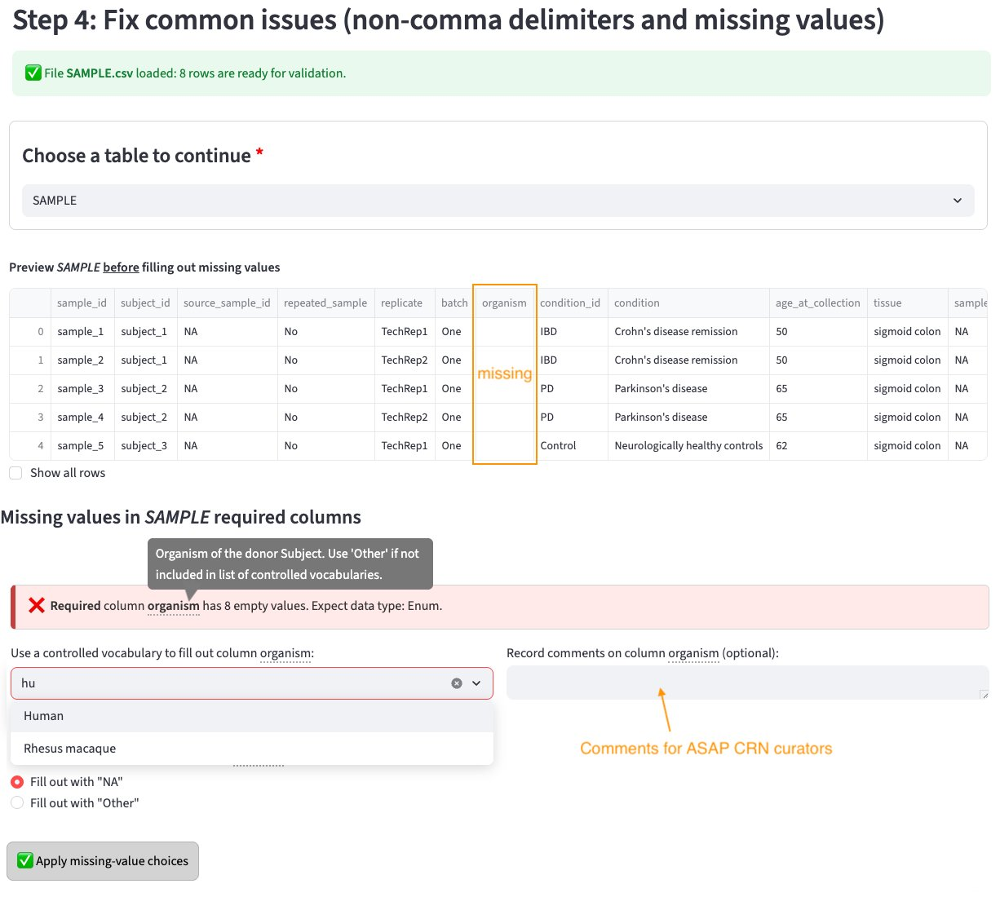

# Step 4: Fix common issues

Before comparing against the CDE, the app checks each uploaded table for two common problems: non-comma delimiters and missing values.

{ width="700" }

## What the app checks

### Delimiter issues
CSV files must use commas as the delimiter. If your file uses tabs, semicolons, or other separators, the app will detect this and prompt you to fix it before proceeding.

### Missing values
The app previews your table and indicates which columns have missing values to be filled out either with NA's or one of the values in the controlled vocabularies (for [_Enum_](../faq.md#what-is-an-enum-column) columns). For example, in the image above the user can select an `organism` name to fill out such column.

A free-text box is provided to **record a comment** explaining to ASAP curators if for example none of the predefined values describes correctly the dataset column.

Once you've filled out columns with missing values, proceed to [Step 5](step5-cde-validation.md).

!!! tip
    If the app reports **"No missing values detected"**, your table is clean and you can proceed directly to Step 5.

## Choosing a table

Use the **"Choose a table to continue"** dropdown to switch between your uploaded files and check each one.

