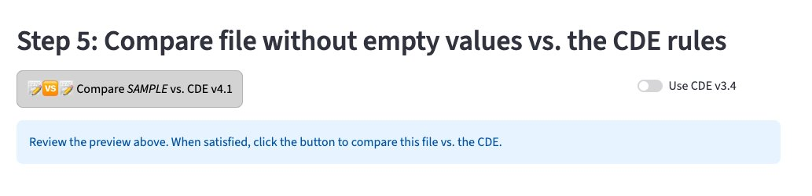
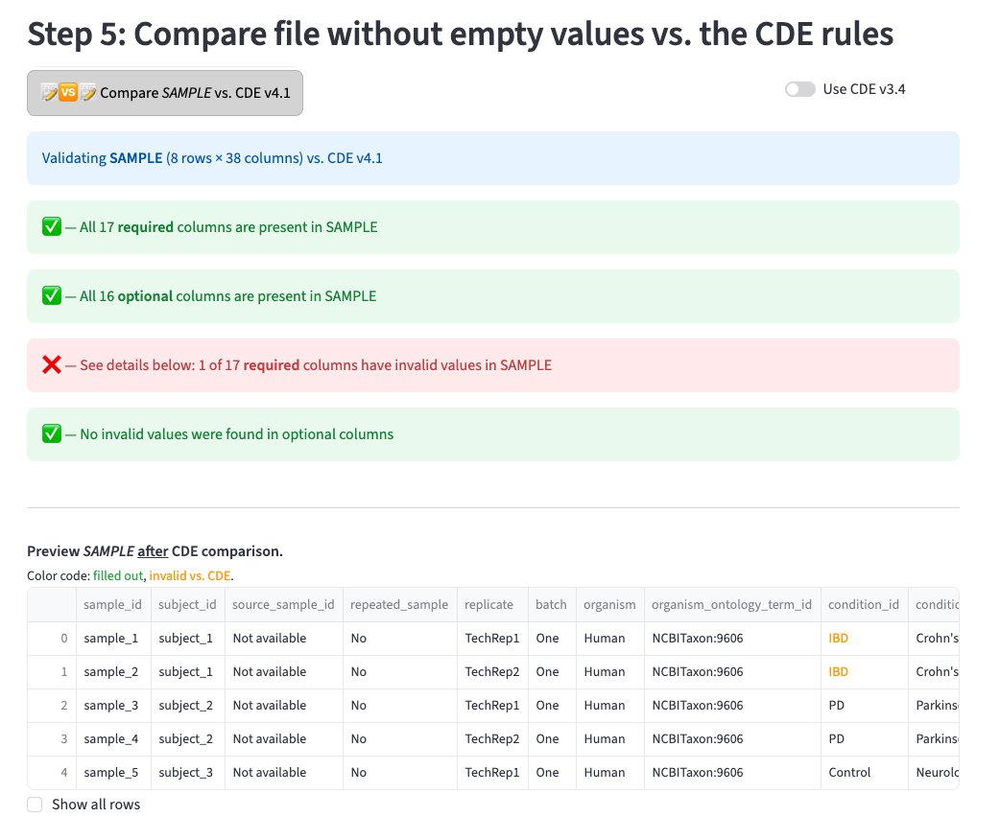
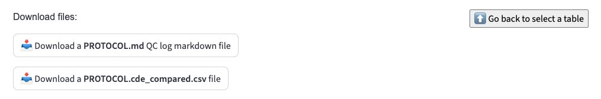

# Step 5: CDE validation

This is the main validation step. The app compares each table against the [ASAP CRN controlled vocabularies (CDE)](https://docs.google.com/spreadsheets/d/1c0z5KvRELdT2AtQAH2Dus8kwAyyLrR0CROhKOjpU4Vc/edit?usp=sharing) and reports any issues.

## Running the comparison

Click the **Compare vs. CDE** button for the table you want to validate.

{ width="700" }

The app will validate your table against the current CDE version. A progress indicator will appear while validation runs.

## Reading the validation report

{ width="700" }

The report shows four summary lines:

- ✅ All required columns are present
- ✅ All optional columns are present  
- ❌ Required columns with invalid values (must fix)
- ✅ No invalid values in optional columns

Below the summary, a color-coded preview of your table highlights invalid values in orange — these are cells where the value does not match the CDE controlled vocabulary.

!!! danger "Errors (❌)"
    Must be fixed before uploading to ASAP CRN Google buckets. The download button for the sanitized CSV will remain disabled until all errors are resolved.

!!! warning "Warnings (⚠️)"
    Recommended to fix but not required. You may proceed with warnings if you have a valid reason — use the comment boxes to explain to ASAP curators.

## Downloading your results

{ width="600" }

Once validation is complete, three files are available to download:

| File | Purpose |
|------|---------|
| `TABLE.md` | Full QC log for your records |
| `TABLE_comments.md` | Your column-level comments for ASAP curators |
| `TABLE.cde_compared.csv` | Sanitized CSV ready to upload *(only enabled if no errors)* |

!!! tip
    Provide the `TABLE_comments.md` file to your ASAP data curator along with your final CSV upload — it gives context for any warnings or missing values.

## After validation

Upload your final files to the Google bucket by following [these instructions](https://docs.google.com/document/d/1Bicp20M0Zi_dc2-4nQJZwOCy5E20LJte0wT9pgKeVag/edit?usp=sharing), then notify your [data manager](mailto:matthieu.darracq@dnastack.com).

!!! note
    If you have multiple tables to validate, use the **"Go back to select a table"** button to repeat Steps 4–5 for each one before uploading.
